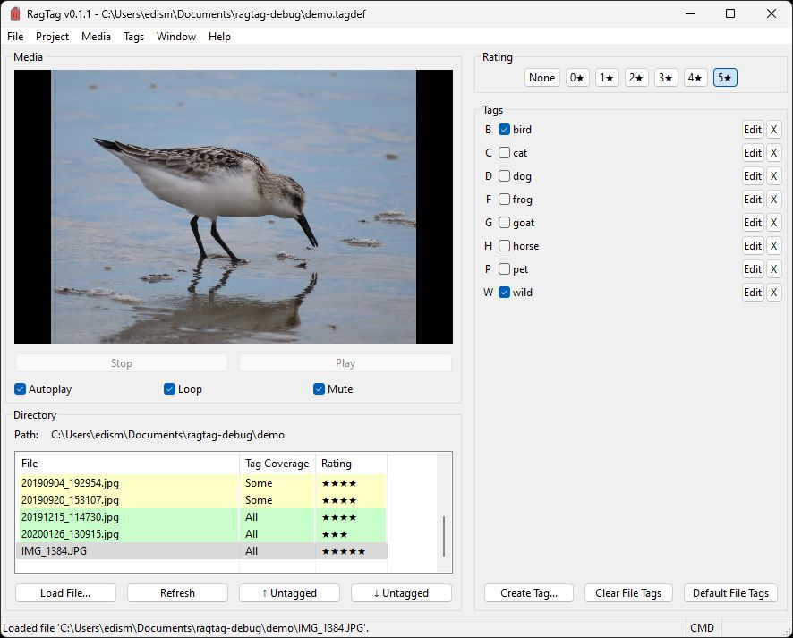
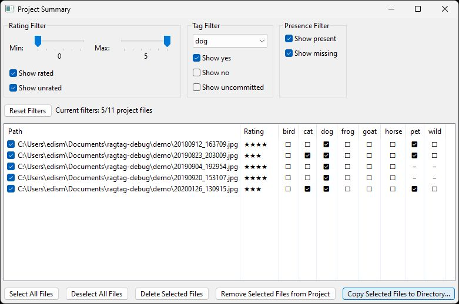

# RagTag
Group files across folders!

RagTag is a Windows application for assigning custom attributes to files so that you can aggregate those files in flexible ways.

## Flow

Create a project, define some attributes, load some media, and get to tagging. Files can have as many or as few tags as you'd like. You can even assign ratings to highlight your favorite files.

Simple controls and the ability to assign hotkeys to tags make the process quick and maybe even a little fun.

Unless you choose to delete files, all your files stay on your machine exactly where they are, and they are never modified. Everything the application needs to describe your project is held in a JSON file linked to that project. Create as many projects as you'd like.

When you're ready, open the Project Summary, filter your files by their attributes, and copy the filtered files to a temporary workspace for whatever final processing you have in mind.

Add more files later? The application will highlight untagged files within a directory so that you can focus on only the new additions.

RagTag works with all files supported by Windows Media Player. This includes most static image formats.

### Command Mode

Command Mode enables efficient keyboard controls for navigating directories and applying tags. To enter Command Mode, focus the main window and press **Esc**.

Key | Action
--- | ------
**Down** | Opens the next file in the active directory.
**Up** | Opens the previous file in the active directory.
**Space** | Opens the next untagged file in the active directory.
**Shift+Space** | Opens the previous untagged file in the active directory.
**A, B, ..., Z** | Applies tag with hotkey A, B, C, etc. 
**Shift+A, Shift+B, ..., Shift+Z** | Removes tag with hotkey A, B, C, etc.

## Example applications

* **Photo albums:** Perhaps you'd like to reminisce on good times you spent with friends--moments you captured through photos across dozens of albums. Just start a project, create a tag for each friend, and assign the tags to your photos. Then, use filters in the Project Summary to revisit memories you shared with specific people.
  * RagTag spares you the need to group these files manually and is especially helpful when files have multiple descriptors that might otherwise lead to duplicating a file into multiple directories, like a group shot that has Alex and Brittany and Charlie and Devin all together.
  * Hint: This is a great way to make a photo album celebrating special people in your life!
* **Compilation videos:** Perhaps you've recorded a bunch of video game clips from years of gaming and you'd like to make compilation videos with different themes highlighting memorable moments (e.g., clutch plays, big mistakes, funny glitches). Just start a project, create a tag for each theme, assign the tags to your videos, and use the Project Summary to sort them however you'd like. Toss these clips into the video-editing tool of your choice and do your thing.
  * The ability to form thematic groups independent of folder hierarchy is especially useful for video files, which tend to be considerably larger than images.
  * Have too much material for one highlight reel? Use the rating filter to locate only top-tier clips.
* **Music playlists:** Perhaps you have music tracks from your favorite eclectic indie artists and want to make playlists by music genre. You guessed it: just start a project, create a tag for each genre, assign the tags to your music, and use the Project Summary to find tracks matching the mood you're looking for.

## Releases

Grab the latest release [here](https://github.com/e-foley/RagTag/releases).

## License

RagTag is &copy; 2025 by Edward Foley.

The application is published under the [GNU General Public License](https://www.gnu.org/licenses/gpl-3.0.en.html). Consult the full text of the license in [COPYING.txt](COPYING.txt).

RagTag is free software: you can redistribute it and/or modify it under the terms of the GNU General Public License as published by the Free Software Foundation, either version 3 of the License, or (at your option) any later version.

RagTag is distributed in the hope that it will be useful, but WITHOUT ANY WARRANTY; without even the implied warranty of MERCHANTABILITY or FITNESS FOR A PARTICULAR PURPOSE. See the GNU General Public License for more details.

You should have received a copy of the GNU General Public License along with RagTag. If not, see <https://www.gnu.org/licenses/>.

## Acknowledgments

RagTag is built using [wxWidgets](https://wxwidgets.org/). I employ Niels Lohmann's [JSON for Modern C++](https://github.com/nlohmann/json/) library for JSON writing/parsing and [Catch2](https://github.com/catchorg/Catch2) for unit testing.

I am deeply grateful for the teams of dedicated, selfless contributors that make these projects possible and also thankful that they have shared their work with the world for others like myself to incorporate into their own works.

Please see [LICENSE-3RD-PARTY.txt](LICENSE-3RD-PARTY.txt) for the licenses under which these libraries are distributed.

The RagTag logo was designed by [Freepik](https://www.freepik.com/).

## Contributing

Currently, RagTag has a development team of one. You are welcome to clone the [RagTag repository](https://github.com/e-foley/RagTag) and submit pull requests to be considered for inclusion into the primary codebase. The project's maintainer, [Ed Foley](https://github.com/e-foley), will decide whether to approve or reject these changes.

## Support

If you encounter a bug in the program, please [open an issue](https://github.com/e-foley/RagTag/issues) if an appropriate issue does not already exist.

If you have a [question](https://github.com/e-foley/RagTag/discussions/categories/q-a) about RagTag or an [idea](https://github.com/e-foley/RagTag/discussions/categories/ideas) for a new feature, please share it using the [GitHub Discussions](https://github.com/e-foley/RagTag/discussions) interface.
